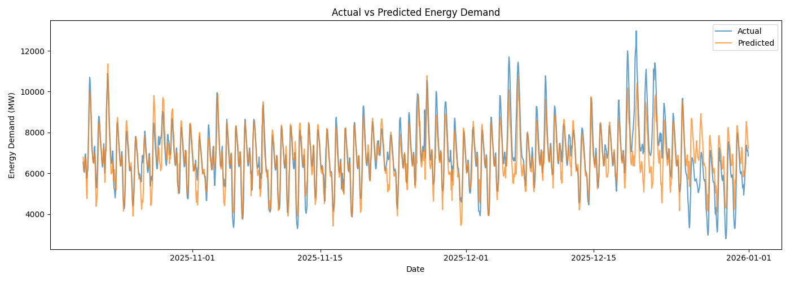
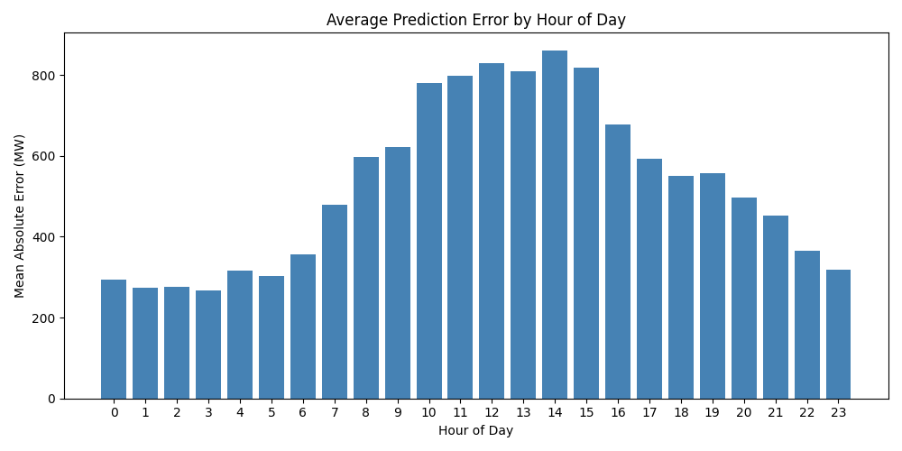
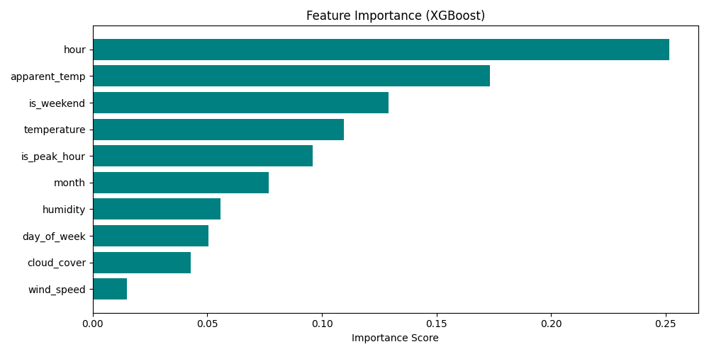

# Energy Demand Forecasting Pipeline 🔋


> An end-to-end machine learning pipeline that predicts hourly electricity demand 
> for New South Wales, Australia using real weather data and historical energy consumption.

🌐 **Live App:** http://54.91.10.150:8501  
🔗 **Live API:** http://54.91.10.150:8000/docs

---

## What this project does

This pipeline ingests real hourly weather data from the Open-Meteo API and historical 
electricity demand data from AEMO (Australian Energy Market Operator), engineers 
meaningful features, trains and evaluates multiple ML models, and serves live predictions 
through an interactive web application deployed on AWS EC2.

**The core question:** Given the weather conditions and time of day, how much 
electricity will NSW need in the next hour?

---

## Tech stack

| Layer | Technology |
|---|---|
| Data ingestion | Open-Meteo API, AEMO |
| Feature engineering | Python, Pandas |
| ML models | Scikit-learn, XGBoost |
| REST API | FastAPI |
| Web app | Streamlit |
| Deployment | AWS EC2 |
| Automation (planned) | AWS Lambda, S3, EventBridge |
| Version control | Git, GitHub |

---

## Model performance

| Metric | Value | Benchmark |
|---|---|---|
| RMSE | 259.37 MW | Industry standard 300–500 MW ✅ |
| MAE | 180.16 MW | — |
| MAPE | 2.79% | Under 5% is strong ✅ |
| Overfit gap | 102 MW | Healthy generalisation ✅ |

---

## Model development journey

The model went through three stages of improvement:

| Stage | Test RMSE | MAPE | Overfit Gap | Features |
|---|---|---|---|---|
| Baseline XGBoost | 812 MW | 8.06% | 626 MW | 10 |
| Hyperparameter tuning | 763 MW | 8.06% | 411 MW | 10 |
| Feature engineering | 259 MW | 2.79% | 102 MW | 19 |

Key improvement came from adding lag features — giving the model memory of previous demand values — plus public holiday flags, season indicators, and extreme heat flags.

---

## Model evaluation plots

### Actual vs predicted demand


### Prediction error by hour of day


### Feature importance


---

## Data sources

- **Weather:** Open-Meteo API — free hourly historical and forecast weather for Sydney
- **Energy:** AEMO Aggregated Price and Demand Data — real NSW electricity demand 2025–2026

---

## How to run locally

```bash
git clone https://github.com/muhasan87/energy-demand-forecast.git
cd energy-demand-forecast
python3 -m venv venv
source venv/bin/activate
pip install -r requirements.txt
python src/ingestion/fetch_weather.py
python src/ingestion/fetch_energy.py
python src/features/build_features.py
python src/models/train.py
streamlit run streamlit_app.py
```